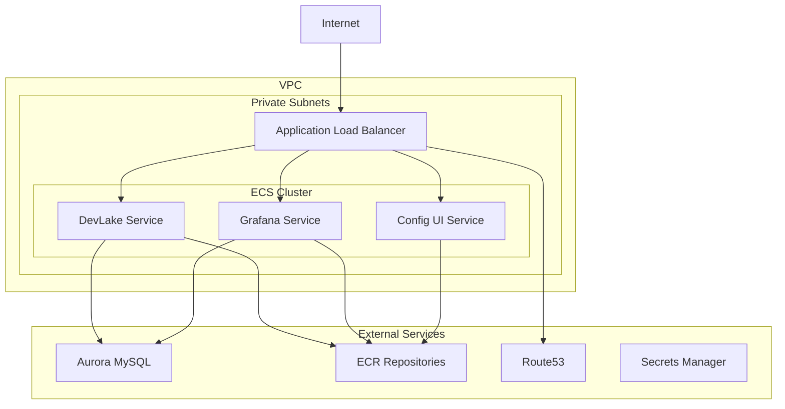

# Apache DevLake AWS ECS Infrastructure

This repository contains Terraform configurations to deploy Apache DevLake on AWS ECS Fargate with an Application Load Balancer.

## Infrastructure Overview



## Prerequisites

1. AWS Account with appropriate permissions
2. Terraform >= 1.0.10
3. Existing VPC with private subnets
4. Existing Aurora MySQL instance
5. Existing Route53 hosted zone
6. Existing ECR repositories:
   - devlake
   - devlake-grafana
   - devlake-config-ui
7. AWS Secrets Manager secret named `devlaked1` containing:
   ```json
   {
     "host": "your-aurora-endpoint",
     "port": "3306",
     "username": "your-username",
     "password": "your-password",
     "dbname": "lake"
   }
   ```

## Directory Structure

```
.
├── terraform/
│   ├── main.tf           # Provider configuration and data sources
│   ├── backend.tf        # Terraform Enterprise backend configuration
│   ├── ecs.tf           # ECS cluster and IAM roles
│   ├── services.tf      # ECS task definitions and services
│   ├── alb.tf          # ALB and target groups
│   ├── dns.tf          # Route53 records and CloudWatch logs
│   └── terraform.tfvars # Variable values
└── README.md
```

## Deployment Instructions

1. Configure Terraform Enterprise:
   - Update `terraform/backend.tf` with your organization and workspace details
   - Ensure you have appropriate permissions in Terraform Enterprise

2. Configure Variables:
   - Update `terraform/terraform.tfvars` with your AWS account and region
   - Verify ECR repository URLs match your existing repositories

3. Deploy Infrastructure:
   ```bash
   cd terraform
   terraform init
   terraform plan
   terraform apply
   ```

## Infrastructure Components

### ECS Cluster
- Fargate-based cluster named `devlake-cluster`
- Container Insights enabled
- Task execution and task roles with appropriate permissions

### Services
1. DevLake Service
   - Port: 8080
   - CPU: 1024
   - Memory: 2048MB
   - Health check: /ping

2. Grafana Service
   - Port: 3000
   - CPU: 512
   - Memory: 1024MB
   - Health check: /api/health

3. Config UI Service
   - Port: 4000
   - CPU: 256
   - Memory: 512MB
   - Health check: /

### Load Balancer
- Internal ALB
- HTTP listener on port 80
- Path-based routing:
  - /api/* → DevLake service
  - /grafana/* → Grafana service
  - / → Config UI service

### DNS
- Creates A record in Route53
- Points to ALB
- Uses existing hosted zone

### Monitoring
- CloudWatch log groups for each service
- 30-day log retention
- Container Insights enabled on ECS cluster

## Security

- Services run in private subnets
- Internal ALB
- IAM roles with least privilege
- Secrets stored in AWS Secrets Manager
- Security groups with least privilege required access

## Maintenance

### Updating Container Images
1. Push new images to ECR repositories
2. Update task definitions with new image tags
3. Force new deployment of ECS services

### Scaling
- Services are configured for 1 task each
- Adjust `desired_count` in ECS services to scale horizontally
- Modify CPU and memory in task definitions to scale vertically

## Cleanup

To destroy the infrastructure:
```bash
cd terraform
terraform destroy
```

## Troubleshooting

1. Check CloudWatch logs for container issues
2. Verify security group rules
3. Check ALB target group health
4. Validate MySQL connection
5. Review ECS service events

